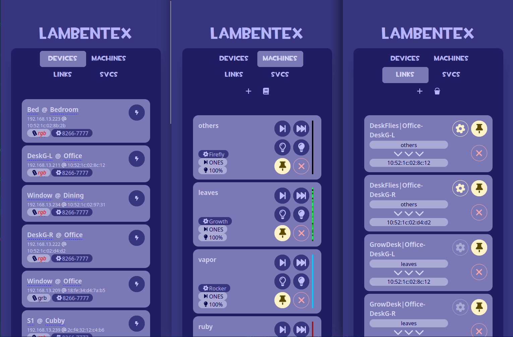
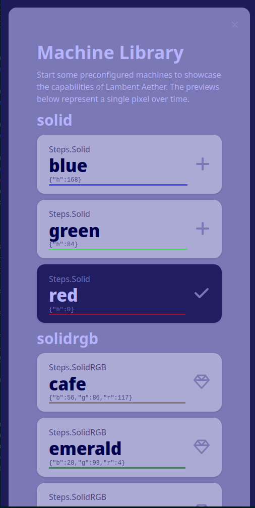

# LambentEx 


[](https://hub.docker.com/r/lambentri/lambentex)
[](https://quay.io/repository/lambentri/lambent_ex)

[](https://gitter.im/Lambentri/community?utm_source=badge&utm_medium=badge&utm_campaign=pr-badge)

A Reimplementation of Lambent Aether 4, in Elixir

<p align="center">




</p>

## Information

### New Features

- 8266ws2812i2s device implementation is 100x more robust in device discovery on-net ~avoids booming current ones too often~
- Devices can be virtually grouped to "Places"
- Individual Machine Brightness Controls
- Machine Persistence / Link Persistence
- ~Links can target groups~ 
- Machine Previews 
- Machine Library replaces `default.yml`

### Device Support

- ESP8266-WS2812-I2S
- ##### TODO
- Home-Assistant `Light` Entities

### Built-in Machines

- Solid (~RGB~/HSV)
- Rainbow (Cycling/Solid)
- Chaser (Single, ~Multi~)
- Rocker
- Scapes
- Firefly
- Growth
- ##### TODO
- Static Image / GIF
- Twinkles
- GSI Receiver
- FFT Receiver
- Hyperion Receiver
- ApollosCrib Receiver

## Running

Docker
```
docker pull ghcr.io/lambentri/lambentex:latest
# OR
docker pull lambentri/lambentex
# OR
docker pull quay.io/lambentri/lambent_ex

docker run --net=host -d --restart always --mount type=bind,source="$(pwd)"/meta,target=/opt/app/meta lambentri/lambentex 
```

TODO: Podman
TODO: Compose(s)

Then load host:4000 in your web browser

## Development

To start your Phoenix server:

  * Install dependencies with `mix deps.get`
  * Start Phoenix endpoint with `mix phx.server` or inside IEx with `iex -S mix phx.server`

Now you can visit [`localhost:4000`](http://localhost:4000) from your browser.

## Production

`docker build -t "lambentri/lambentex:latest" .`
